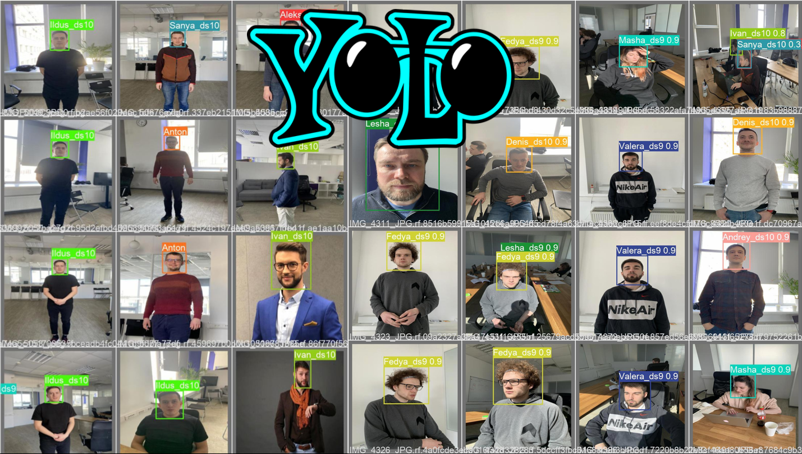
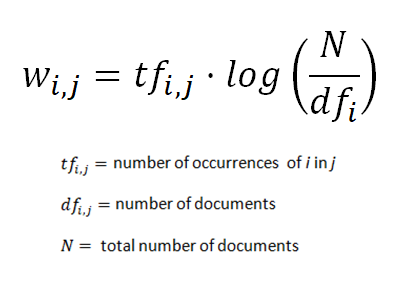

## Рекомендательная система для компании друзей
* Предобработка:
  * Сбор фотографий людей, на основании которых обучалась модель YOLOV5
  * Разметка фотографий с помощью roboflow
  * Сбор данных и создание датасета с информацией о наших юзерах, их оценках и фильмах
* Обучение модели

* Создание рекомендательной системы:
  * Использование векторизатора tf-idf для получения векторного представления данных. 
  
  * Поиск похожих векторов tf-idf (фильмов) с помощью меры косинусного сходства.
* Создание телеграм бота с помощью библиотеки aiogram
* Парсинг постеров фильмов в реальном времени

Для презентации проекта была выбрана его реализация в виде телеграм бота. В дальнейшем подобная система может быть встроена в любой онлайн кинотеатр с доступом к социальным сетям, фотографиям для обучения детекционной модели и выдачи подходящих рекомендаций.  
